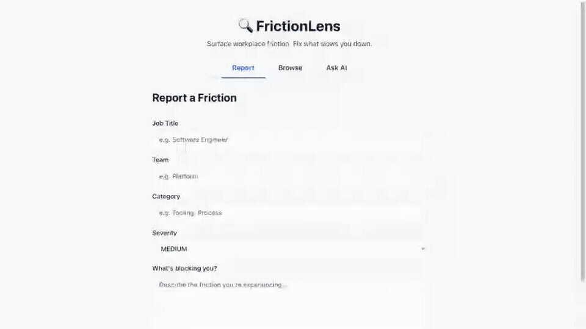

# FrictionLens

A lightweight, privacy-preserving system that helps organizations understand where and why work gets stuck—without tracking individuals.

---

## Demo



> Submit friction reports, browse and filter them, then ask AI to summarize the biggest pain points — all in one flow. Recorded automatically via Playwright.

---

## Overview

FrictionLens is a voluntary "stuck signal" platform where employees can quickly report when their work is blocked. Each report captures the *type of role experiencing friction* (not identity), the context, and a short description of the blocker.

The system aggregates these signals across the organization to reveal recurring bottlenecks, delays, and process inefficiencies. Admins can explore this data through dashboards or a natural-language interface that lets them ask questions like:

- "Why are backend engineers getting stuck this week?"
- "What's slowing down onboarding?"
- "Where are approval bottlenecks occurring?"

The goal is not monitoring people, but mapping structural friction in how work flows through the organization.

---

## Core Principles

- No personal identifiers (no names in free text)
- Only job titles, teams, and system-level context
- Fully voluntary input (no passive tracking)
- Emphasis on aggregation and abstraction, not attribution

---

## Architecture

### Backend
- **Spring Boot 3.5.3** (Java 25, Maven)
- REST API for ingestion, querying, and trend analysis
- Dual-layer sanitization pipeline (regex + LLM) with hallucination guardrails
- Jakarta Bean Validation on all DTOs with field-level error feedback

### Data Layer
- **PostgreSQL 17** with pgvector extension
- Hybrid schema:
  - Structured fields (job_title, team, category, severity, created_at)
  - Unstructured fields (blocker_text + vector embeddings)
- Native SQL queries for hybrid search (vector similarity + structured filters)
- 42 realistic seed reports loaded at bootstrap

### LLM Layer (Local-first)
- **Ollama** (llama3.1:latest)
- Responsibilities:
  - **Text sanitization** — dual-layer approach: regex strips emails, phones, and multi-word names; LLM catches remaining identifiers with length-divergence guardrails
  - **Embedding generation** — vector representations for semantic search
  - **Query interpretation** — extracts structured filters (jobTitle, team, category, severity) from natural language
  - **Report summarization** — generates actionable summaries grounded in retrieved data
- Retry logic with exponential backoff (max 2 retries, 1s then 2s)
- Graceful fallback to regex-only sanitization when Ollama is unavailable

### Frontend
- **React 19** (Vite + TypeScript 6)
- **TanStack Query 5** for server state management
- Three views: Report Form, Reports List, AI Query

---

## Key Features

- **Report submission** — structured form with job title, team, category, severity, and free-text blocker description
- **Privacy-preserving sanitization** — dual-layer pipeline strips PII before storage
- **Browsable reports** — paginated list with multi-field filtering (team, category, severity, job title)
- **Natural-language querying** — ask questions in plain English, get AI-generated summaries with supporting evidence
- **Hybrid search** — combines vector similarity with structured filters for precise results
- **Trend analysis** — aggregate friction data by category, team, severity, or job title over time
- **Health monitoring** — endpoint at `/api/health` reports Ollama availability

---

## Getting Started

### Prerequisites

- **Java 25** (or compatible JDK)
- **Maven 3.9+**
- **Node.js 20+** and npm
- **Docker** and Docker Compose
- **Ollama** installed locally with `llama3.1:latest` pulled

### 1. Start PostgreSQL

```bash
docker-compose up -d
```

This starts PostgreSQL 17 with the pgvector extension enabled on port `5432`.

### 2. Start Ollama

Make sure Ollama is running and the model is available:

```bash
ollama serve          # if not already running
ollama pull llama3.1:latest
```

### 3. Start the Backend

```bash
cd backend
mvn spring-boot:run
```

The API starts on `http://localhost:8080`. On first boot, 42 seed reports are loaded (with embeddings generated via Ollama).

### 4. Start the Frontend

```bash
cd frontend
npm install
npm run dev
```

The frontend starts on `http://localhost:5173` and proxies API requests to the backend.

### 5. Re-record the Demo Video (optional)

With the backend and frontend running:

```bash
cd frontend
npm run e2e:record-demo
```

This runs the Playwright e2e test, records a video, and converts it to `docs/demo.mp4`.

---

## API Endpoints

| Method | Endpoint | Description |
|--------|----------|-------------|
| `POST` | `/api/reports` | Submit a friction report |
| `GET` | `/api/reports` | List reports (paginated, filterable) |
| `POST` | `/api/query` | Natural-language query over friction data |
| `GET` | `/api/trends` | Trend analysis by category/team/severity/jobTitle |
| `GET` | `/api/health` | Health check with Ollama status |

---

## Project Structure

```
FrictionLens/
├── backend/                  # Spring Boot API
│   └── src/main/java/com/frictionlens/
│       ├── config/           # CORS, Ollama, vector index, seed data
│       ├── controller/       # REST endpoints
│       ├── dto/              # Request/response objects
│       ├── model/            # JPA entities
│       ├── repository/       # Data access (native SQL + pgvector)
│       └── service/          # Business logic (sanitization, search, LLM)
├── frontend/                 # React + Vite app
│   └── src/
│       ├── api/              # API client and TypeScript types
│       └── components/       # ReportForm, ReportsList, QueryView
└── docker/                   # PostgreSQL init scripts
```

---

## Core Idea

FrictionLens turns subjective "I got stuck" moments into a structured map of organizational bottlenecks—without ever identifying individuals.
